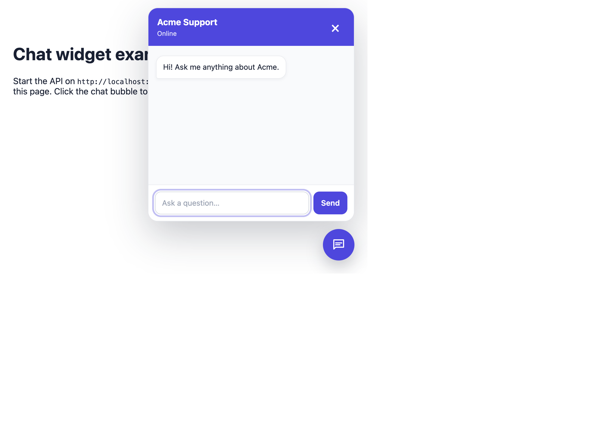
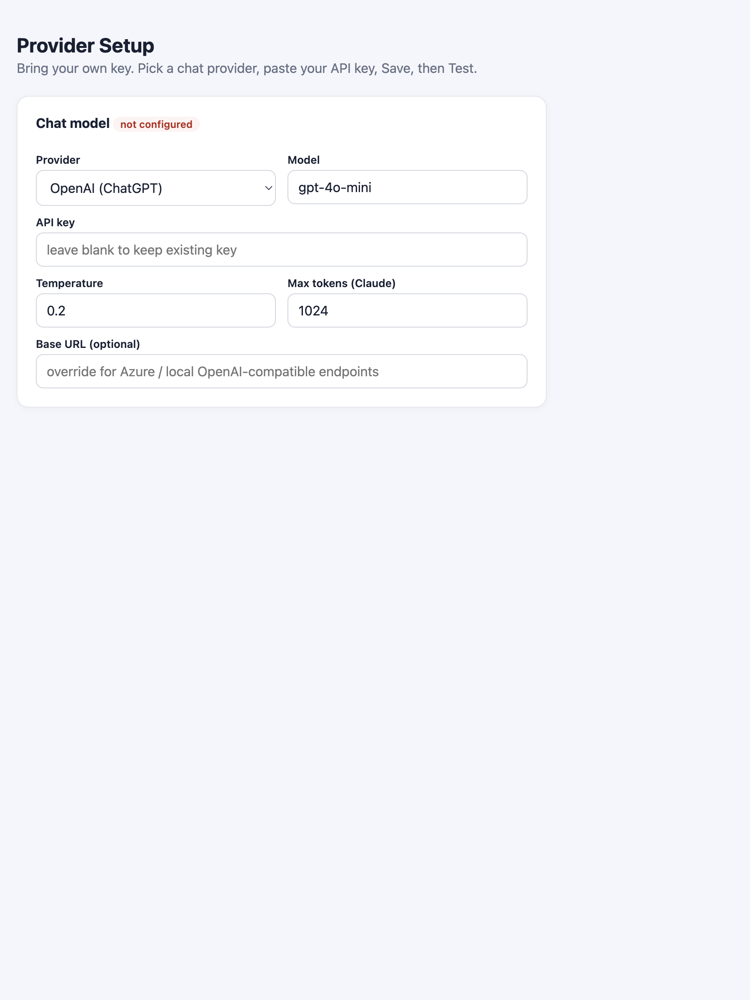
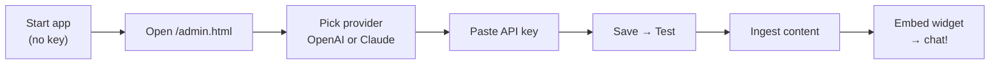
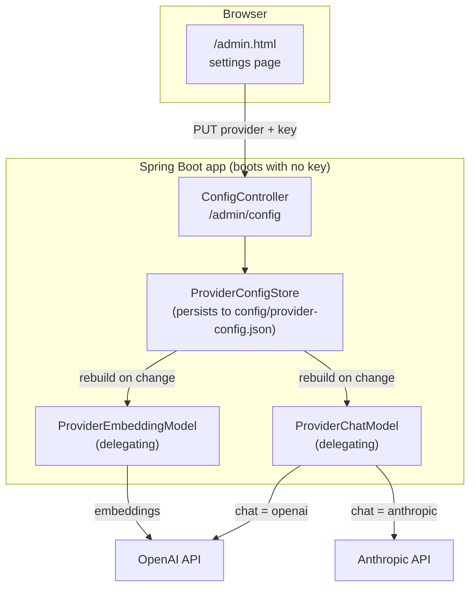
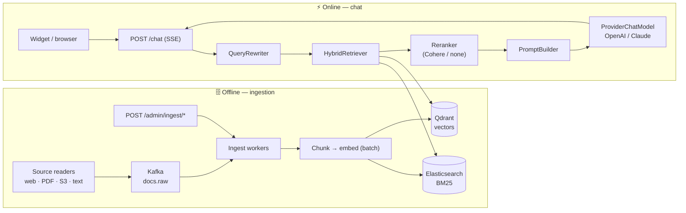
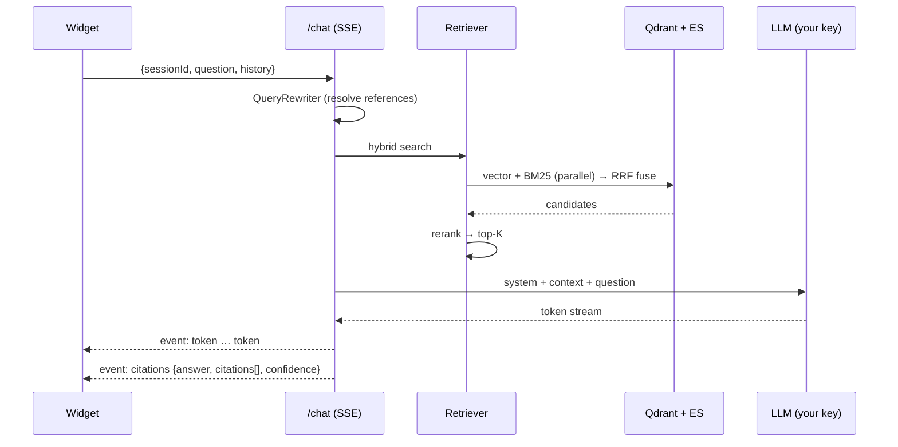

# Chat Assistant — Bring-Your-Own-Key RAG for Any Website

A Java + Spring Boot **RAG** (Retrieval-Augmented Generation) system you can drop onto any
site. It ingests your content, grounds answers in it with citations, and streams replies to an
**embeddable chat widget** — using **your own API key** for **OpenAI (ChatGPT)** or
**Anthropic (Claude)**.

- 🔑 **Bring your own key** — the app boots with **no key**; configure a provider at runtime from a settings page.
- 🔁 **Swap providers live** — OpenAI ⇄ Anthropic without a restart or code change.
- 🧠 **Hybrid retrieval** — dense vectors (Qdrant) + BM25 keywords (Elasticsearch), fused with RRF, then reranked.
- 📚 **Grounded + cited** — answers come only from your content, with inline source citations.
- 💬 **One-line widget** — a floating chat bubble you paste into any page.

---

## 📸 What you get

| Embeddable widget | Bring-your-own-key setup page |
| --- | --- |
|  |  |

---

## 🚀 Quickstart (5 minutes, your own key)

```bash
cd chat-assistant

# 1. Start the data plane (Qdrant + Elasticsearch + Redis + Postgres + Kafka)
docker compose up -d

# 2. Run the app — no API key needed to boot
./mvnw spring-boot:run
#   (or: mvn spring-boot:run)
```



**3. Configure your provider** — open **http://localhost:8080/admin.html**, choose
OpenAI or Anthropic, paste your key, click **Save**, then **Test connection**.

Prefer the API?

```bash
curl -X PUT http://localhost:8080/admin/config \
  -H 'Content-Type: application/json' \
  -d '{
    "chatProvider":"openai",
    "chatModel":"gpt-4o-mini",
    "chatApiKey":"sk-...",
    "embeddingProvider":"openai",
    "embeddingModel":"text-embedding-3-small",
    "embeddingApiKey":"sk-...",
    "embeddingDimensions":1536,
    "brand":"Acme Corp"
  }'

curl -X POST http://localhost:8080/admin/config/test   # validates your keys
```

**4. Ingest some content:**

```bash
# a web page
curl -X POST http://localhost:8080/admin/ingest/url \
  -H 'Content-Type: application/json' \
  -d '{"url":"https://your-company.com/help/billing"}'

# or a local folder of docs
./scripts/ingest-local-folder.sh ./sample-docs
```

**5. Try it:**

```bash
curl -N -X POST http://localhost:8080/chat \
  -H 'Content-Type: application/json' \
  -d '{"sessionId":"demo","question":"How do I cancel my Pro plan?"}'
```

…or open [`widget/embed-example.html`](widget/embed-example.html) in a browser.

> ℹ️ Chat and embeddings use **your** provider account, so the account must have credits.
> A key with an empty balance returns `insufficient_quota` (see [Troubleshooting](#-troubleshooting)).

---

## 🔑 Bring your own key — how it works

The app never hard-codes a provider. A small control plane stores your choice and builds the
model client at runtime.



### Provider support matrix

| Capability | OpenAI (ChatGPT) | Anthropic (Claude) | OpenAI-compatible / local |
| --- | :---: | :---: | :---: |
| Chat / answers | ✅ | ✅ | ✅ (set a Base URL) |
| Embeddings | ✅ | ❌ *(no embeddings API)* | ✅ (set a Base URL) |

> **Why two keys?** Claude has **no embeddings API**. RAG needs embeddings, so chat can be
> Claude while embeddings come from OpenAI (or a local OpenAI-compatible model such as Ollama).
> If you use OpenAI for both, one key covers everything.

### Settings reference (`PUT /admin/config`)

| Field | Example | Notes |
| --- | --- | --- |
| `chatProvider` | `openai` \| `anthropic` | Answer generation |
| `chatModel` | `gpt-4o-mini`, `claude-3-5-sonnet-20241022` | |
| `chatApiKey` | `sk-...` / `sk-ant-...` | Blank on update = keep existing |
| `chatBaseUrl` | `https://api.openai.com` | Optional (Azure / local endpoints) |
| `chatTemperature` | `0.2` | |
| `chatMaxTokens` | `1024` | Required by Claude |
| `embeddingProvider` | `openai` | OpenAI-compatible only |
| `embeddingModel` | `text-embedding-3-small` | |
| `embeddingApiKey` | `sk-...` | Blank on update = keep existing |
| `embeddingDimensions` | `1536` | **Must match the Qdrant collection** |
| `brand` | `Acme Corp` | Shown in widget + prompts |

API keys are stored locally in `config/provider-config.json` (git-ignored) and returned
**masked** (`••••QQ8A`) by `GET /admin/config`. In production, put this behind auth and a
secret manager.

---

## 🏗️ Architecture



### Online request flow



### Why this stack

| Concern | Choice | Why |
| --- | --- | --- |
| Model provider | **OpenAI / Anthropic (runtime)** | Bring your own key; swap live |
| Ingestion streaming | **Apache Kafka** | Decoupled, horizontally scalable, replayable |
| Vector store | **Qdrant** | Billions of vectors, HNSW ANN, payload filters |
| Sparse / BM25 | **Elasticsearch** | Battle-tested full-text at any size |
| Reranking | **Cohere Rerank v3** (optional) | Big accuracy lift; `none` = passthrough |
| API | **Spring Boot 3 + WebFlux** | SSE streaming, non-blocking |
| Metadata & audit | **Postgres** | Source tracking, freshness, delta re-ingest |
| Cache | **Redis** | Query/embedding cache, rate limits |
| Deployment | **Docker → Kubernetes** | Stateless API replicas, stateful data plane |

---

## 📥 Ingestion

Produce documents through any of these, all funnel into the same chunk → embed → upsert pipeline:

| Method | Endpoint / entry | Use for |
| --- | --- | --- |
| Web page | `POST /admin/ingest/url` | A single help/docs/careers page |
| PDF | `POST /admin/ingest/pdf` (multipart) | Manuals, policies |
| Raw text | `POST /admin/ingest/text` | Custom/pushed content |
| Batch | `POST /admin/ingest/batch` | Many docs at once |
| S3 | `POST /admin/ingest/s3` | Bucket scan |
| Kafka | topic `docs.raw` | TB-scale continuous ingest |

Re-ingesting a document overwrites its chunks (stable IDs), so updates don't duplicate.

---

## 🧩 Embedding the widget

Add one line to your site before `</body>`:

```html
<script src="https://your-cdn.com/chat-widget.js"
        data-api="https://api.yourcompany.com/chat"
        data-brand="Acme Corp"
        data-greeting="Hi! How can I help?"
        data-accent="#2563eb"></script>
```

| Attribute | Default | Purpose |
| --- | --- | --- |
| `data-api` | same-origin `/chat` | Backend chat endpoint |
| `data-brand` | `Chat Assistant` | Header title |
| `data-greeting` | `Hi! How can I help?` | First message |
| `data-accent` | `#2563eb` | Brand color |

The script auto-loads `chat-widget.css` from the same folder. See
[`widget/embed-example.html`](widget/embed-example.html) for a local demo (serve the `widget`
folder over HTTP while the API runs).

---

## ⚙️ Scaling notes (TB-scale)

- **Kafka partitions** = ingest parallelism. Start at 32; add ingest-worker replicas per consumer group.
- **Embedding throughput** is the usual bottleneck — batch aggressively (`embedding-batch-size: 64+`); consider a self-hosted model on GPU.
- **Qdrant**: shard (`shard_number=N`) + replicate; payload indexes on `source_type`, `updated_at`.
- **Elasticsearch**: index-per-source-type with size rollover; per-language analyzers.
- **Vector math**: 1M chunks × 1536 dim × 4 B ≈ 6 GB; 1B chunks ≈ 6 TB before HNSW overhead.

---

## 🗂️ Directory layout

```
chat-assistant/
├── README.md
├── docker-compose.yml            # full data plane (Qdrant, ES, Redis, Postgres, Kafka)
├── docker-compose.local.yml      # lean local stack (no Kafka, conflict-free ports)
├── pom.xml                       # Spring Boot 3 / Java 21
├── Dockerfile
├── scripts/ingest-local-folder.sh
├── docs/images/                  # README screenshots
├── src/main/java/com/company/chatassistant/
│   ├── provider/                 # 🔑 bring-your-own-key: config store, delegating models, /admin/config
│   ├── model/                    # DTOs
│   ├── config/                   # bean wiring, CORS
│   ├── ingestion/                # readers, Kafka, workers, S3
│   ├── chunking/                 # markdown/header-aware chunker
│   ├── embedding/                # embedding service
│   ├── retrieval/                # hybrid retriever, BM25, vector store, reranker
│   └── chat/                     # controller, service, prompt, query rewrite
├── src/main/resources/
│   ├── application.yml
│   ├── application-local.yml      # local profile (ports, Kafka off)
│   └── static/admin.html          # 🔑 provider setup page
└── widget/                        # embeddable JS/CSS widget
    ├── chat-widget.js
    ├── chat-widget.css
    └── embed-example.html
```

---

## 🧯 Troubleshooting

| Symptom | Cause | Fix |
| --- | --- | --- |
| `insufficient_quota` / `credit_balance_exhausted` on Test | Your provider account has no credits | Add billing credits, or use a local OpenAI-compatible model via `Base URL` |
| `No chat/embeddings provider configured` | No key set yet | Configure at `/admin.html` or `PUT /admin/config` |
| Widget shows "couldn't get a response" | Backend down, wrong `data-api`, or CORS | Check the API URL/port; `app.cors.allowed-origins` must allow the site origin |
| Port 8080 already in use | Another app owns 8080 | Run on another port: `--server.port=8088` and update the widget `data-api` |
| `bitnami/kafka:3.7 not found` | Old image tag removed upstream | Already switched to `apache/kafka:3.7.0`; or use `docker-compose.local.yml` (no Kafka) |
| Postgres/Redis port clash | Another stack uses 5432/6379 | Use `docker compose -f docker-compose.local.yml up -d` (maps 5433/6380) + `--spring.profiles.active=local` |
| Changed `embeddingDimensions` and search breaks | Qdrant collection has the old dimension | Recreate the collection and re-ingest |

### Run fully free / offline (no OpenAI account)

Point both chat and embeddings at a local OpenAI-compatible server (e.g. [Ollama](https://ollama.com)):

```jsonc
// PUT /admin/config
{
  "chatProvider": "openai",
  "chatModel": "llama3.2",
  "chatApiKey": "ollama",
  "chatBaseUrl": "http://localhost:11434/v1",
  "embeddingProvider": "openai",
  "embeddingModel": "nomic-embed-text",
  "embeddingApiKey": "ollama",
  "embeddingBaseUrl": "http://localhost:11434/v1",
  "embeddingDimensions": 768
}
```

---

## 🔒 Not included yet (add before production)

- Auth on `/chat`, `/admin/ingest/**`, and `/admin/config` (JWT / API-key gateway).
- Per-tenant isolation (`tenant_id` filter in Qdrant + ES) and rate limiting (Redis token bucket).
- Secret manager for provider keys (instead of the local JSON file).
- Full observability (OpenTelemetry traces per stage) and a retrieval eval set (`recall@k`).

---

## 📎 Endpoint reference

| Method | Path | Purpose |
| --- | --- | --- |
| `GET` | `/admin.html` | Provider setup page |
| `GET` | `/admin/config` | Current config (keys masked) |
| `PUT` | `/admin/config` | Set provider(s) + key(s) |
| `POST` | `/admin/config/test` | Validate keys with a live call |
| `POST` | `/admin/ingest/url` · `/pdf` · `/text` · `/batch` · `/s3` | Ingest content |
| `POST` | `/chat` | Chat (SSE stream) |
| `GET` | `/chat/health` | Health check |
